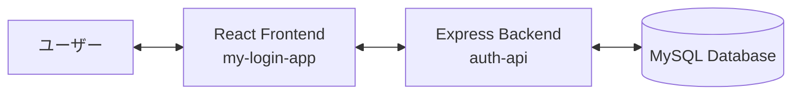

# 🏗️ 03. アーキテクチャ

Memo Platform のシステム構成とデータの流れについて詳しく説明します。

## 🗺️ 全体構成

アプリケーションは、React フロントエンドと Express バックエンドが完全に分離されたシングルページアプリケーション (SPA) 構成を採用しています。

## ⚛️ フロントエンド (`my-login-app`)

- **UI コンポーネント**: React コンポーネントによるモジュール化設計。
- **ステート管理**: React Hooks (`useState`, `useEffect`)。
- **認証管理**: JWT を LocalStorage または Cookie で管理。
- **通信**: Axios/Fetch による REST API 呼び出し。

## 🚀 バックエンド (`auth-api`)

- **ルーティング**: Express.js による明示的なルート定義。
- **ビジネスロジック**: `services/` レイヤーに集約。
- **データアクセス**: Prisma ORM による抽象化された DB 操作。
- **認証フィルタ**: `middleware/` で JWT によるアクセス制限を実装。

## 🔄 データの流れ (認証例)

1.  **Login**: ユーザーが認証情報を送信。
2.  **Verify**: バックエンドでハッシュ化されたパスワードと称号。
3.  **Token**: 認証成功時に JWT を生成しフロントエンドへ返却。
4.  **Authorized Request**: 次回以降、フロントエンドはトークンをヘッダーに含めてリクエスト。
5.  **Middleware**: バックエンドのミドルウェアがトークンの妥当性を検証。

---

次は [📁 04. リポジトリ構造](./04-リポジトリ構造.md) を見て、コードがどこに配置されているか確認しましょう。
