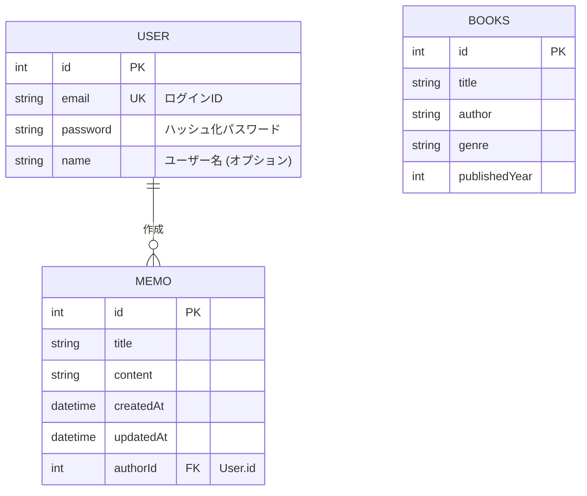

# 🗄️ 05. データモデル

データベースの設計と、Prisma で定義されたモデルについて詳述します。

## 📊 ER 図 (概念)

## 📝 Prisma スキーマ定義

詳細は `auth-api/prisma/schema.prisma` を参照してください。

### `User` モデル

ユーザーのアカウント情報を管理します。

- `email` はユニークキーとして設定されており、ログイン ID として使用されます。
- `memos` フィールドで `Memo` モデルと 1 対多 のリレーションを持ちます。

### `Memo` モデル

アプリケーションの主要データであるメモを管理します。

- `authorId` によって作成者の `User` と紐付けられます。
- `createdAt`, `updatedAt` により自動的にタイムスタンプが管理されます。

### `Books` モデル (参考)

プロジェクト内のサンプルデータとして定義されています。

## 🔧 マイグレーション

Prisma を使用してスキーマの変更を管理しています。反映には以下のコマンドを使用します：
`npx prisma migrate dev`

---

次は [📦 06. コアコンポーネント](./06-コアコンポーネント.md) で、実装の詳細に触れていきます。
